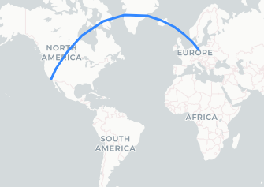
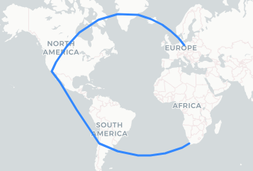
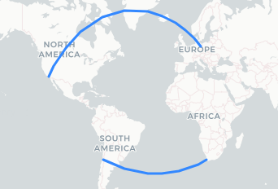
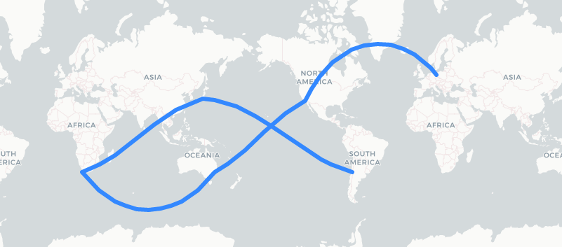
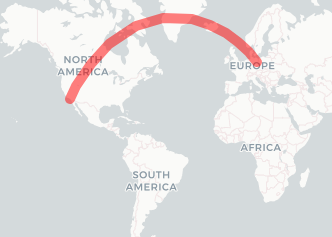

# Leaflet.Geodesic
[](https://app.travis-ci.com/github/henrythasler/Leaflet.Geodesic) [](https://www.npmjs.com/package/leaflet.geodesic) [](https://coveralls.io/github/henrythasler/Leaflet.Geodesic?branch=master) [](https://sonarcloud.io/dashboard?id=henrythasler_Leaflet.Geodesic)

Add-on for [Leaflet](http://leafletjs.com/) to draw [geodesic](http://en.wikipedia.org/wiki/Geodesics_on_an_ellipsoid) lines and circles. A geodesic line is the shortest path between two given positions on the earth surface. It's based on [Vincenty's formulae](https://en.wikipedia.org/wiki/Vincenty%27s_formulae) implemented by [Chris Veness](https://github.com/chrisveness/geodesy) for highest precision.

[](https://blog.cyclemap.link/Leaflet.Geodesic/basic-interactive.html)

[Live Demos and Tutorials](https://blog.cyclemap.link/Leaflet.Geodesic/)

[Observable-Notebook](https://observablehq.com/@henrythasler/leaflet-geodesic)

[API-Documentation](https://blog.cyclemap.link/Leaflet.Geodesic/api)

## Add the plugin to your project

Leaflet.Geodesic is available via CDN. Add the following snippet to your html-file after you have [included leaflet.js](https://leafletjs.com/examples/quick-start/).

```html
<!-- Make sure you put this AFTER leaflet.js -->
<script src="https://cdn.jsdelivr.net/npm/leaflet.geodesic"></script>
```

Leaflet.Geodesic is available from [unpkg](https://unpkg.com/browse/leaflet.geodesic/), [jsDelivr](https://www.jsdelivr.com/package/npm/leaflet.geodesic) and [npmjs](https://www.npmjs.com/package/leaflet.geodesic).

Add it in your nodejs-project with `npm i leaflet.geodesic`.

If possible, pin the plug-in to a specific version and use [Subresource Integrity](https://developer.mozilla.org/en-US/docs/Web/Security/Subresource_Integrity). Check the [release page](https://github.com/henrythasler/Leaflet.Geodesic/releases) for the latest version, links and checksum. A checksum can by verified with `npm run build`, is stored in `dist/leaflet.geodesic.umd.min.js.sha512` on [jsDelivr](https://www.jsdelivr.com/package/npm/leaflet.geodesic?path=dist) and [unpkg](https://unpkg.com/browse/leaflet.geodesic/dist/leaflet.geodesic.umd.min.js.sha512) and is shown in the [build-log](https://app.travis-ci.com/github/henrythasler/Leaflet.Geodesic/builds) for a tagged version.

## Basic usage

- `L.Geodesic` draws geodesic lines between all points of a given line- or multiline-string. 
- `L.GeodesicCircle` draws a circle with a specific radius around a given point.

The Objects can be created as follows:

```JavaScript
const geodesicLine = new L.Geodesic().addTo(map);   // creates a blank geodesic-line-object and adds it to the map
const geodesicCircle = new L.GeodesicCircle().addTo(map);   // creates a blank geodesic-circle-object and adds it to the map
```

Alternative method:

```JavaScript
const geodesicLine = L.geodesic().addTo(map);   // lower-case, w/o new-keyword
const geodesicCircle = L.geodesiccircle().addTo(map);   // lower-case, w/o new-keyword
```

Make sure you add the geodesic-object to the map. It won't display otherwise.

Each constructor is defined as:
```JavaScript
Geodesic(latlngs?: L.LatLngExpression[] | L.LatLngExpression[][], options?: GeodesicOptions)
GeodesicCircle(center?: L.LatLngExpression, options?: GeodesicOptions)
```

Both classes are extended from [L.Polyline](http://leafletjs.com/reference.html#polyline), so all methods, events and options for `L.Polyline` can be used with `L.Geodesic` and `L.GeodesicCircle` here as well.

## Geodesic Lines

This draws a line. The geometry (points) to use can be given during creation as:

### Objects (Literals)

```JavaScript
const Berlin = {lat: 52.5, lng: 13.35};
const LosAngeles = {lat: 33.82, lng: -118.38};
const geodesic = new L.Geodesic([Berlin, LosAngeles]).addTo(map);
```

### LatLng-Class

```JavaScript
const Berlin = new L.LatLng(52.5, 13.35);
const LosAngeles = new L.LatLng(33.82, -118.38);
const geodesic = new L.Geodesic([Berlin, LosAngeles]).addTo(map);
``` 

### Tuples

```JavaScript
const Berlin = [52.5, 13.35];
const LosAngeles = [33.82, -118.38];
const geodesic = new L.Geodesic([Berlin, LosAngeles]).addTo(map);
```



### Line-strings

Multiple consecutive points can be given as an array (linestring):

```JavaScript
const places = [
    new L.LatLng(52.5, 13.35), // Berlin
    new L.LatLng(33.82, -118.38), // Los Angeles
    new L.LatLng(-33.44, -70.71), // Santiago
    new L.LatLng(-33.94, 18.39), // Capetown
];
const geodesic = new L.Geodesic(places).addTo(map);
```



### Multi-line-strings

Multiple independent linestrings can be defined as a 2-dimensional array of points:

```JavaScript
const places = [
    [   // 1st line
        new L.LatLng(52.5, 13.35), // Berlin
        new L.LatLng(33.82, -118.38), // Los Angeles
    ],
    [   // 2nd line
        new L.LatLng(-33.44, -70.71), // Santiago
        new L.LatLng(-33.94, 18.39), // Capetown
    ]
];
const geodesic = new L.Geodesic(places).addTo(map);
```



### GeoJSON-Support

GeoJSON-data can be used to create geodesic lines with the `fromGeoJson()` method:

```JavaScript
const geojson = {
    "type": "LineString",
    "coordinates": [
        [13.35, 52.5], [-122.33, 47.56], [18.39, -33.94], [116.39, 39.92], [13.35, 52.5]
    ]
};
const geodesic = new L.Geodesic().addTo(map);
geodesic.fromGeoJson(geojson);
```


### Updating the geometry

#### Set new geometry

The Geodesic-Class provides a `setLatLngs()`-Method, that can be used to update the geometry of an existing `L.Geodesic`-object:

```Javascript
const geodesic = new L.Geodesic().addTo(map);   // add empty object to the map

const Berlin = new L.LatLng(52.5, 13.35);
const LosAngeles = new L.LatLng(33.82, -118.38);

geodesic.setLatLngs([Berlin, LosAngeles])   // update in-place
```

The `setLatLngs()`-Method accepts the same types (Literal, Tuple, LatLang-Class, Linstring, Multilinestring) as the L.Geodesic-constructor itself. Please refer to the section about geodesic circles below, on how to update a circle geometry.

#### Delete geometry

Delete the existing geometry by setting an empty array `geodesic.setLatLngs([])`.

#### adding points

Points can be added to existing geodesic lines with `addLatLng()`:

```Javascript
const Berlin = new L.LatLng(52.5, 13.35);
const LosAngeles = new L.LatLng(33.82, -118.38);
const Beijing = new L.LatLng(39.92, 116.39);

const geodesic = new L.Geodesic([Berlin, LosAngeles]).addTo(map);
geodesic.addLatLng(Beijing);    // results in [[Berlin, LosAngeles, Beijing]
```

The new point will always be added to the last linestring of a multiline. You can define a specific linestring to add to by reading the `points` property before and hand over a specific linestring as second parameter:

```Javascript
const Berlin = new L.LatLng(52.5, 13.35);
const LosAngeles = new L.LatLng(33.82, -118.38);
const Beijing = new L.LatLng(39.92, 116.39 );
const Capetown =  new L.LatLng(-33.94, 18.39 );
const Santiago = new L.LatLng(-33.44, -70.71);

const geodesic = new L.Geodesic([[Berlin, LosAngeles], [Santiago, Capetown]]).addTo(map);
geodesic.addLatLng(Beijing, geodesic.points[0]);    // results in [[Berlin, LosAngeles, Beijing], [Santiago, Capetown]]
```

### Drawing over the antimeridian

In some cases it is required to draw over the antimeridian (dateline) to show a continuous path. This is possible by setting the `wrap`-option to false. Leaflet.Geodesic will make sure to shift the individual points to draw a continuous line, even if the coordinates are not properly aligned to a map section. See [interactive example](https://blog.cyclemap.link/Leaflet.Geodesic/multiline-nosplit.html)

```Javascript
const Berlin = new L.LatLng(52.5, 13.35);
const LosAngeles = new L.LatLng(33.82, -118.38);
const Capetown =  new L.LatLng(-33.94, 18.39 );
const Santiago = new L.LatLng(-33.44, -70.71);
const Tokyo = new L.LatLng(35.47, 139.15 + 360);    // these points are in another map section
const Sydney = new L.LatLng(-33.91, 151.08 + 10 * 360); // but will get shifted accordingly

const geodesic = L.geodesic(
    [ Santiago, Tokyo, Capetown, Sydney, LosAngeles, Berlin], 
    { wrap: false
}).addTo(map);
```



### Line Options
All options defined for [Polyline](http://leafletjs.com/reference.html#polyline) and [Path](https://leafletjs.com/reference.html#path) for can be used Leaflet.Geodesic.

The most important options are:

Option  | Type | Default | Description
---|---|---|---
`color` |	`String` | "#3388ff" | Stroke color
`weight` | `Number` | 3 | Stroke width in pixels
`opacity` | `Number` | 1.0 | Stroke opacity (0=transparent, 1=opaque)
`steps` | `Number` | 3 | Level of detail (vertices = 1+2**(steps+1)) for the geodesic line. More steps result in a smoother line. Range: 0..8
`wrap` | `Boolean` | true | Wrap geodesic line at antimeridian. Set to `false`, to draw a line over the antimeridian. See [no-wrap demo](https://blog.cyclemap.link/Leaflet.Geodesic/nowrap-interactive.html) for example.

Example:

```Javascript
const Berlin = new L.LatLng(52.5, 13.35);
const LosAngeles = new L.LatLng(33.82, -118.38);
const options = {
    weight: 20,
    opacity: 0.5,
    color: 'red',
};
const geodesic = new L.Geodesic([Berlin, LosAngeles], options).addTo(map);
```



## Geodesic Circles

Circles can be added with another class called `L.GeodesicCircle` as follows:

```Javascript
const Seattle = new L.LatLng(47.56, -122.33);
const geodesiccircle = new L.GeodesicCircle(Seattle, {
    radius: 3000*1000,  // 3000km in meters
}).addTo(map);   
```


The geometry of a circle can be updated with the following methods:

- `setLatLng(latlng: L.LatLngExpression)` - set a new center
- `setRadius(radius: number)` - update the radius

Handling of **filled** circles crossing the antimeridian (wrapping) is not yet supported. Set `fill: false` in these cases to avoid display artefacts.

### Circle Options

Option  | Type | Default | Description
---|---|---|---
`radius` | `Number` | 1000*1000 | Radius in **meters**
`steps` | `Number` | 24 | Number of segments that are used to approximate the circle.
`fill` | `boolean` | true | Draws a filled circle.
`color` |	`String` | "#3388ff" | Stroke color
`weight` | `Number` | 3 | Stroke width in pixels
`opacity` | `Number` | 1.0 | Stroke opacity (0=transparent, 1=opaque)

Please refer to the options for [Polyline](http://leafletjs.com/reference.html#polyline) and [Path](https://leafletjs.com/reference.html#path) for additional settings.

## Statistics

The `L.Geodesic` and `L.GeodesicCircle`-class provide a `statistics`-Object with the following properties:

Property | Type | Description
---|---|---
`totalDistance` |	`Number` | The total distance of all geodesic lines in meters. (Circumfence for `L.GeodesicCircle`)
`distanceArray` | `Number[]` | The distance for each separate linestring in meters
`points` | `Number` | Number of points that were given on creation or with `setLatLngs()`
`vertices` | `Number` | Number of vertices of all geodesic lines that were calculated

## Distance Calculation

The `L.Geodesic` provides a `distance`-function to calculate the precise distance between two points:

```Javascript
const Berlin = new L.LatLng(52.5, 13.35);
const Beijing = new L.LatLng(39.92, 116.39);

const line = new L.Geodesic();
const distance = line.distance(Berlin, Beijing);
console.log(`${Math.floor(distance/1000)} km`) // prints: 7379 km
```

The `L.GeodesicCircle`-class provides a `distanceTo`-function to calculate the distance between the current center and any given point:

```Javascript
const Berlin = new L.LatLng(52.5, 13.35);
const Beijing = new L.LatLng(39.92, 116.39);

const circle = new L.GeodesicCircle(Berlin);
const distance = circle.distanceTo(Beijing);
console.log(`${Math.floor(distance/1000)} km`) // prints: 7379 km
```

## Scientific background

All calculations are based on the [WGS84-Ellipsoid](https://en.wikipedia.org/wiki/World_Geodetic_System#WGS84) (EPSG:4326) using [Vincenty's formulae](https://en.wikipedia.org/wiki/Vincenty%27s_formulae). This method leads to very precise calculations but may fail for some corner-cases (e.g. [Antipodes](https://en.wikipedia.org/wiki/Antipodes)). I use some workarounds to mitigate these convergence errors. This may lead to reduced precision (a.k.a. slightly wrong results) in these cases.  This is good enough for a web mapping application but you shouldn't plan a space mission based on this data. OMG, this section has just become a disclaimer...
