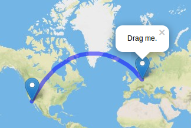
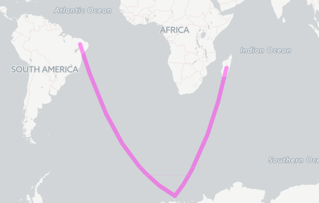

# Leaflet.Geodesic

Add-on for [Leaflet](http://leafletjs.com/) to draw [geodesic](http://en.wikipedia.org/wiki/Geodesics_on_an_ellipsoid) lines and great circles. A geodesic line is the shortest path between two given positions on the earth surface. Wrapping at lng=180° is handled correctly. The master branch is compatible with Leaflet v1.0.2+.

[](http://www.thasler.com/leaflet.geodesic/example/interactive.html)

It is based on [geodesy](https://github.com/chrisveness/geodesy) by Chris Veness that gives extremely precise results.


## Live-Demo
- [Static Demo](http://www.thasler.com/leaflet.geodesic/example/simple.html)
- [Interactive Demo](http://www.thasler.com/leaflet.geodesic/example/interactive.html)
- [Interactive Demo (noWrap)](http://www.thasler.com/leaflet.geodesic/example/interactive-noWrap.html)
- [Great Circle Demo](http://www.thasler.com/leaflet.geodesic/example/circle.html)
- [geoJSON Demo (static)](http://www.thasler.com/leaflet.geodesic/example/geojson.html)

## Usage
Add the source to your project/html-file after `leaflet.js`:
```html
<script src="leaflet.js"></script>
<script src="Leaflet.Geodesic.js"></script>
```

Leaflet.Geodesic can be used similar to Leaflet's [Polyline](http://leafletjs.com/reference.html#polyline).

### Creation
```JavaScript
L.geodesic( <LatLng[][]> latlngs, <Geodesic options> options? )
```

### Options
Geodesic has the following options:

Option  | Type | Default | Description
-------------: | ------------- | ------------- | :-------------
`steps`  | `Number` | `10` | Defines how many intermediate points are generated along the path. More steps mean a smoother path but more resources.
`color`  | `String` | `blue` | Stroke color.
`dash`  | `Number` | `1` | Use a number between 0..1 to create a dashed line. The given number represents the percentage of the actual dash between each intermediate point (`0.5` means the line is drawn half the length) defined by `steps`. See example below.
`wrap`  | `Boolean` | `true` | Wrap line at map border (date line). Set to 'false' if you want lines to cross the dateline (experimental, see noWrap-example on how to use)

All options of Leaflet's [Polyline](http://leafletjs.com/reference.html#polyline) can be used as well.

### Tutorial
You need to add the plugin in your html file **after** the leaflet file

```html
<script src="leaflet.js"></script>
<script src="Leaflet.Geodesic.js"></script>
```


This code creates an empty Geodesic object:
```JavaScript
var Geodesic = L.geodesic([], {
	weight: 7,
	opacity: 0.5,
	color: 'blue',
	steps: 50
}).addTo(map);
```

To actually draw a line, we need to create and set the coordinates of our geodesic line:
```JavaScript
var berlin = new L.LatLng(52.5, 13.35);
var losangeles = new L.LatLng(33.82, -118.38);

Geodesic.setLatLngs([[berlin, losangeles]]);
```

A geodesic line can have more than two Points:
```JavaScript
var berlin = new L.LatLng(52.5, 13.35);
var losangeles = new L.LatLng(33.82, -118.38);
var capetown = new L.LatLng(-33.91, 18.41);

Geodesic.setLatLngs([[berlin, losangeles, capetown]]);
```

You can also draw independent lines within one geodesic object:
```JavaScript
var berlin = new L.LatLng(52.5, 13.35);
var losangeles = new L.LatLng(33.82, -118.38);
var capetown = new L.LatLng(-33.91, 18.41);
var sydney = new L.LatLng(-33.91, 151.08);

Geodesic.setLatLngs([[berlin, losangeles], [capetown, sydney]]);
```

### Great circles
Draw a circle around a given position.
``` JavaScript
L.Geodesic.createCircle(<LatLng> center, <Number> radius)
```
Parameter | Type | Description
-------------: | ------------- | :-------------
`center`  | `L.LatLng` | geographic position/center of the circle
`radius`  | `Number` | Radius of the circle in **metres**

#### Example
``` JavaScript
var Geodesic = L.geodesic([], {steps:40}).addTo(map);
Geodesic.createCircle(new L.LatLng(61.07, -114.35), 1500000);
```


see also: [Great Circle Demo](http://www.thasler.com/leaflet.geodesic/example/circle.html)

### Create geodesic objects from GeoJSON
Draw geodesic lines given in GeoJSON-format. `LineString`, `MultiLineString` and `Polygon` geometries are supported.

* Refer to [GeoJSON-Specification (RFC7946)](https://tools.ietf.org/html/rfc7946) for details.
* Draw your own GeoJSON-Objects at [geojson.io](http://geojson.io).

Parameter | Type | Description
-------------: | ------------- | :-------------
`geojson`  | `Object` | GeoJSON-Object to draw as geodesic-lines.

```JavaScript
var geojsonExample =
{
	"type": "FeatureCollection",
	"features": [
		{
			"type": "Feature",
			"properties": {},
			"geometry": {
				"type": "LineString",
				"coordinates": [
					[-40.07, -6.66],
					[16.17, -69.16],
					[46.75, -20.30]
				]
			}
		}
	]
}

var geodesicLayer = L.geodesic([], {
	weight: 7,
	opacity: 0.5,
	color: '#ff33ee',
	steps: 50,
	wrap: false,
}).addTo(map)

geodesicLayer.geoJson(geojsonExample)
```


## FAQ
#### Q: How can I use a custom icon with leaflet?
see http://jsfiddle.net/h1r3yagb/

#### Q: I want to draw only part (eg. halfway) of a geodesic line between two places?
see http://jsfiddle.net/h1r3yagb/2

## Legacy Branch for Leaflet v0.7.7 and before
Please look at the branch [legacy](https://github.com/henrythasler/Leaflet.Geodesic/tree/legacy) to use Leaflet.Geodesic with Leaflet v0.7.7 and before. The master and testing branches can only be used with Leaflet v1.0.0+.

## License
GPL V3
