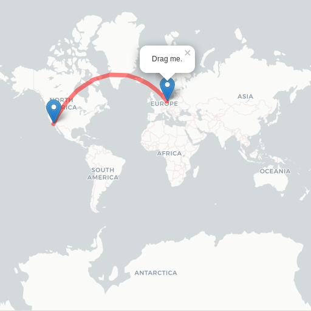
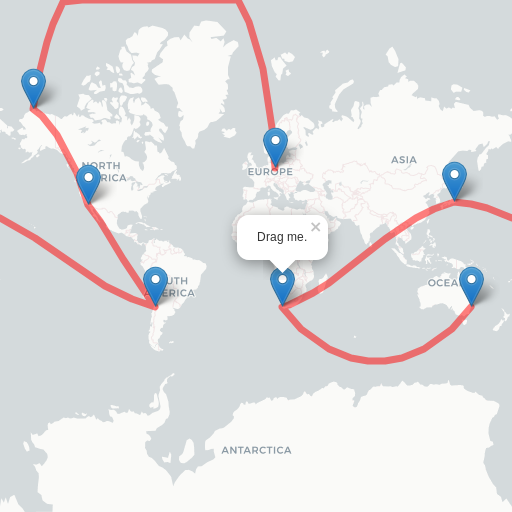
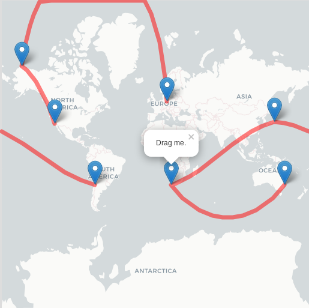
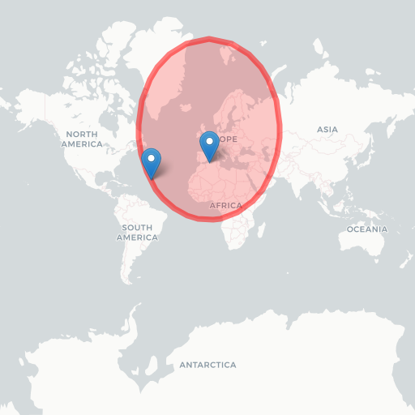
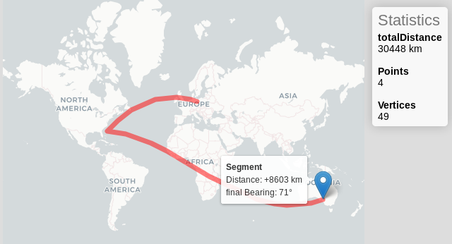
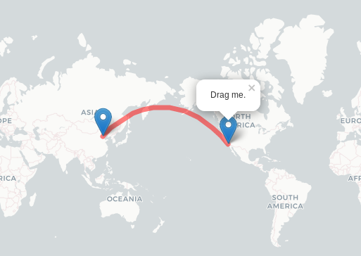
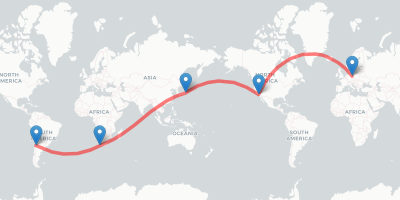

Click on an image to open the demo:

## Basic interactive

## Interactive Linestring

## Interactive Multi-Linestring

## Interactive Circle

## GeoJSON import

[geojson-drag-drop](geojson-drag-drop.html)

## Interactive measurement

## No Wrap Interactive

## Continuous Drawing

