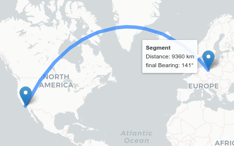

Click on an image to open the demo:

## Basic Interactive

## Interactive Linestring

## Interactive Multi-Linestring

## Interactive Circle

## Animated Flightpath

## Basic Measurement

This is an example on how to directly add geodesic information to a permanent tooltip of a draggable marker.

